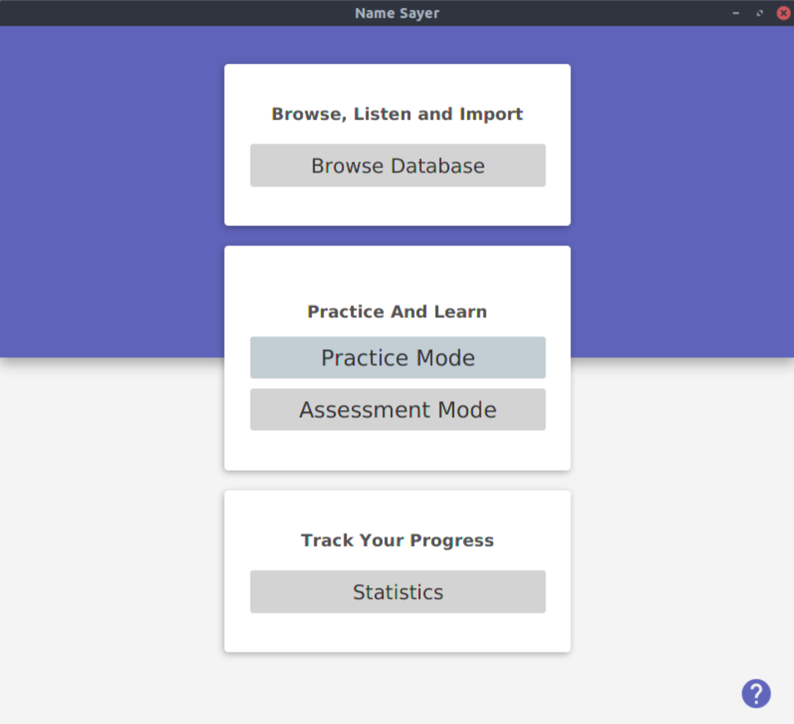

# NameSayer

NameSayer is a JavaFX application which helps users practise unfamiliar names. The user will be able to listen to the recordings stored in the name database and record their own recordings.

<p float="left">
  
  
</p>
<p float="left">
  
  
</p>


## Dependencies
- Oracle Java 8 version 1.8.0_121 or newer (Java 9 and 10 are not supported)
- Oracle JavaFX runtime (normally bundled with Java 8)
- FFmpeg
- FFplay version 3.4.4
- Microphone and audio output

## Installation
Download the names database contained in repo:
```
git clone https://github.com/Minus20Five/NameSayer2.git
```
Download [NameSayer.jar](https://github.com/Minus20Five/NameSayer2/releases/latest) and copy into repo 

```
cd NameSayer2
java -jar NameSayer.jar
```


## License
[MIT](https://choosealicense.com/licenses/mit/)